## Part 1. Установка ОС

* Команда для вывода версии Ubuntu: 

	~$` cat /etc/issue.net`

	

## Part 2. Создание пользователя

Создание пользователя, отличного от созданного при установке и добавление его в группу ` adm `:

1. Создааем нового пользователя с помощью команды `useradd`. В качестве примера создадим пользователя с именем `newuser`:

	~$` sudo useradd -m newuser `

	Параметр `-m` указывает на то, что домашняя директория пользователя должна быть создана автоматически.

2. Добавляем нового пользователя в группу `adm`:

	~$  `usermod -aG adm newuser`

	Параметр `-a` указывает на то, что пользователь должен быть добавлен в группу, даже если он уже входит в эту группу. Параметр `-G ` 	используется для добавления пользователя в одну или несколько групп.

3. Проверяем, был ли пользователь успешно добавлен в группу `adm`:

	~$`cat /etc/passwd`
	
	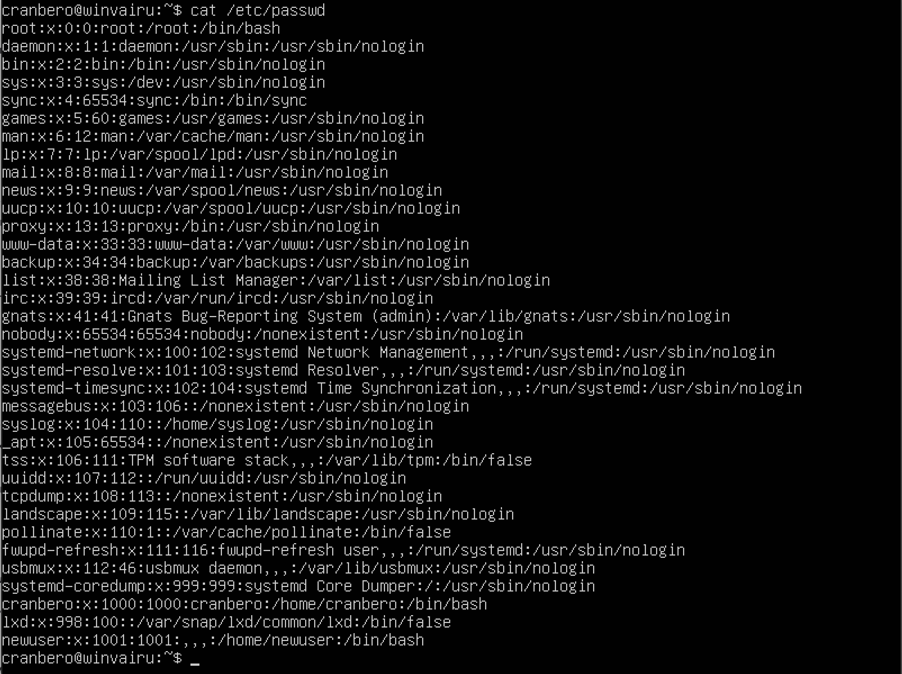

## Part 3. Настройка сети ОС

1. Изменение название машины вида user-1:

	~$`hostnamectl set-hostname winvairu-1`
	
	

2. Установка временной зоны, по моему местоположению:

	~$`timedatectl set-timezone Europe/Moscow`

	

3. Консольная команда для вывода сетевых интерфейсов:

	~$`ip link`

	

	* `lo` - это loopback интерфейс, который используется для обращения к самому себе внутри системы;

	* `enp0s3` - это Ethernet интерфейс, подключенный к сети.

4. Консольная команда для получения ip адреса моего рабочего устройства от DHCP сервера:

	* ~$`ip a`

		
	
	* В данном примере IP-адрес 10.0.2.15 был получен устройством через DHCP для интерфейса enp0s3.

		DHCP - это сокращение от Dynamic Host Configuration Protocol, что в переводе с английского означает "протокол динамической конфигурации 		хостов". Это стандартный протокол, используемый в компьютерных сетях для автоматического назначения IP-адресов подключенным устройствам.

		Протокол DHCP работает следующим образом: когда устройство подключается к сети, оно отправляет запрос на специальный сервер DHCP, который 		назначает ему IP-адрес, маску подсети, адрес шлюза по умолчанию и другие необходимые параметры. После этого устройство может полноценно 		участвовать в работе сети.

		Преимущество использования DHCP заключается в том, что администраторам сетей не нужно вручную настраивать каждое устройство, чтобы оно 		могло 	работать в сети. Кроме того, DHCP позволяет легко управлять IP-адресами в сети, переназначая их при необходимости.

5. Определение и вывод на экран внешнего ip-адреса шлюза (ip) и внутреннего IP-адреса шлюза, он же ip-адрес по умолчанию (gw):

	* получения внешнего IP-адреса шлюза

		~$`curl ip.me`

		
	
	*  получение внутреннего IP-адреса шлюза (IP-адрес по умолчанию)

		~$`ip route show default`
	
		
	
6. Cтатичные (заданные вручную, а не полученные от DHCP сервера) настройки ip, gw, dns (используются публичные DNS серверы, например 1.1.1.1 или 	8.8.8.8).

	Настроить все сетевые параметры можно 2-мя способами:
	
	* командами;

	* редактированием конфигурационных файлов.

	При использовании команд все настройки удаляются после перезагрузки системы. Поэтому, если нет необходимости держать выставленные настройки 	в течении долгого времени, то лучше воспользоваться командами.
	
	Рассмотрим вариант настройки сети в конфигурационном файле:
	
	* редактируем файл `etc/netplan/*.yaml`, после редактирования файл выглядит так:

		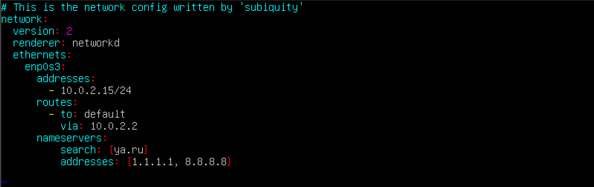
	
	*  Применяем изменения, выполнив команду:

		~$`sudo netplan apply`

	* Перезагружаем виртуальную машину.

	* Успешно пропингуем удаленные хосты 1.1.1.1 и ya.ru:

		~$`ping -c 4 1.1.1.1`
	
		~$`ping -c 4 ya.ru`
	
		`-c 4` указывает отправить 4 пакета (некоторые реализации позволяют указать количество пакетов до бесконечности, используя `-c -1`).
	
		`ya.ru` - это имя хоста, которое будет преобразовано в IP-адрес с помощью DNS.
	
		

## Part 4. Обновление ОС

* Консольная команда для обновления системных пакетов:

	~$`sudo apt update &&  sudo apt full-upgrade -y`

	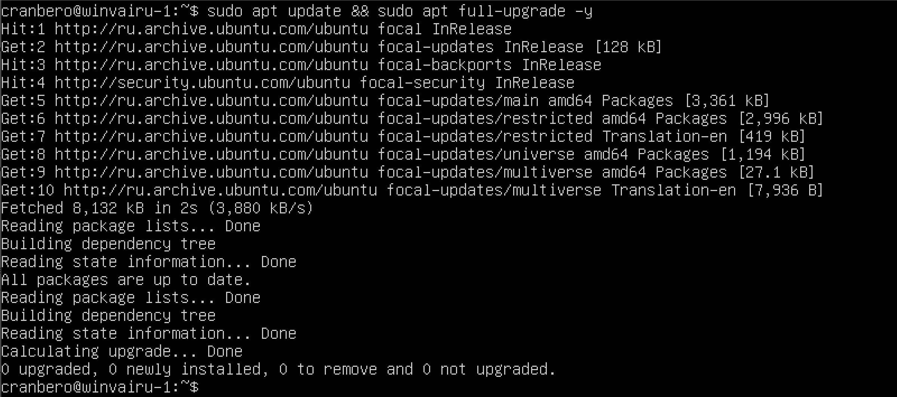

## Part 5. Использование команды sudo

1. Разрешаем пользователю `newuser` выполнять команду `sudo`:

	~$`usermod -aG sudo newuser`

	Команда `sudo` в `Linux` используется для предоставления пользователям возможности выполнять команды от имени другого пользователя, обычно с 	правами суперпользователя `root`. Это позволяет пользователям решать задачи, требующие административных привилегий, без необходимости 	работать 	напрямую под учетной записью `root`. Использование `sudo` помогает ограничить права пользователей и снизить риски безопасности, 	связанные с	работой с правами суперпользователя. Правила, определяющие, какие пользователи могут использовать `sudo` и какие команды они 	могут выполнять,	хранятся в файле `/etc/sudoers`.
	
2. Меняем `hostname` ОС от имени пользователя `newuser` (используя sudo);

	~$`hostnamectl set-hostname winvairu-2`
	
	
	
## Part 6. Установка и настройка службы времени

1. Если нам нужно узнать текущее время в локальном часовом поясe:

	~$`date +%T`
	
	
	
2. ~$`timedatectl show`

	
	
3. Переход с timesyncd на ntpd:

	* отключаем timesyncd ~$`sudo timedatectl set-ntp no`

	* устанавливаем ntp ~$`sudo apt install ntp`
	
	Демон `ntpd` запускается автоматически после установки. Запрашиваем состояние `ntpd`:
	
	~$`ntpq -p`
	
	
	
	`ntpq` – это инструмент запросов для ntpd. Флаг `–p` запрашивает данные о серверах NTP, к которым подключается ntpd. Ваш вывод будет 	отличаться, но в нём всё равно должен быть стандартный пул Ubuntu и несколько других серверов.
	
	На установку соединения ntpd потребуется несколько минут.
	
## Part 7. Установка и использование текстовых редакторов

1. VIM:

	
	
	* Команда для выхода с сохранением изменений: `:wq`

	* Команда для выхода без изменений: `:q!`

		
	
	* Поиска слова и его замена на другое в редакторе Vim:

		`:s/\<cranbero\>/winvairu/`
	
		

2. nano:

	
	
	* Команда для выхода с сохранением изменений: `^S`, `^X`

	* Команда для выхода без изменений: `^X`, `N`

		
	
	* Для поиска и замены текста используется команда `Option+R`.

		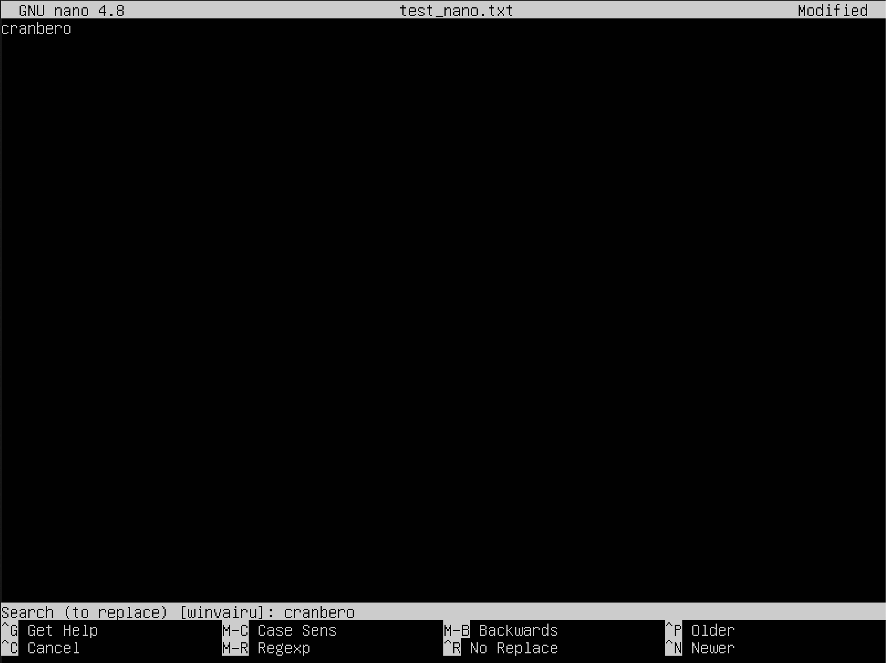
	
		
	
		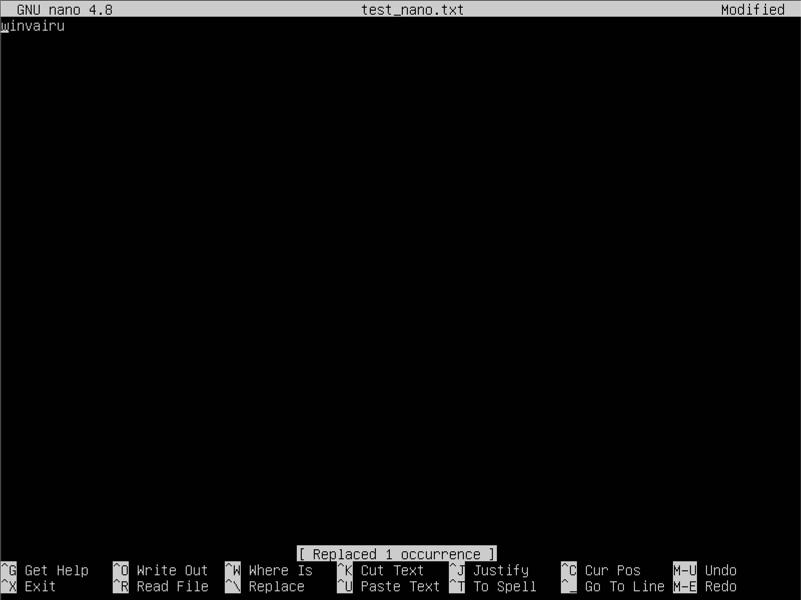
	
3. joe:

	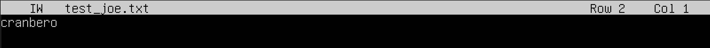

	* Команда для выхода с сохранением изменений: `^KX`

	* Команда для выхода без изменений: `^KQ`

		
	
	* Для выполнения поиска и замены файл должен содержать более одного слова, поэтому добавляем:

		
	
	* Вводим `^K F`. Нам будет предложено ввести строку, которую мы хотим найти, в данном случае `cranbero`:

		
	
	* Затем нам будет предложено указать параметры типа поиска, но в этом простом случае просто нажимаем клавишу `R`;

	* Далее вводим слово для замены и подтверждаем клавишей `Y`:

		
	
## Part 8. Установка и базовая настройка сервиса SSHD

1. Установка службы SSHd:

	~$`sudo apt install openssh-server`
	
2. Добавляем автостарт службы при загрузке системы:

	~$`sudo systemctl enable ssh`
	
3. Перенастройка службы SSHd на порт 2022. Все настройки сервера SSH хранятся в конфигурационном файле `sshd_config`, который находится в папке 	`/etc/ssh`. Перед тем как вносить изменения в этот конфигурационный файл рекомендуется сделать его резервную копию, для этого используем таую 	команду:

	~$`sudo cp /etc/ssh/sshd_config /etc/ssh/sshd_config.factory-defaults`
	
	Переходим к настройке конфигурационного файла:
	
	~$`sudo vim /etc/ssh/sshd_config`
	
	
	
	Перезапускаем службу SSH:
	
	~$`sudo systemctl restart ssh`
	
4.  Находим наличие процесса sshd:

	~$`ps -ax | grep sshd`
	
	Флаг `-a` обозначает все процессы, а `-x` — выводит все процессы, даже те, которые не связаны с текущим TTY.
	
	
	
5. ~$`netstat -tan`:
	
	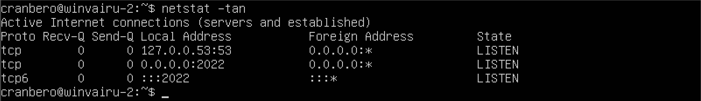
	
	Команда `netstat -tan` в консоли Ubuntu показывает список всех активных сетевых соединений на вашем компьютере. Каждая строка вывода содержит 	следующую информацию:

	* `Proto` - Протокол, используемый для данного соединения. Обычно это TCP или UDP.

	* `Recv-Q` - Количество байт данных, которые были получены от удаленного хоста, но еще не были прочитаны процессом, использующим соединение.

	* `Send-Q` - Количество байт данных, которые были отправлены местным процессом, но еще не были доставлены удаленному хосту.

	* `Local Address` - Локальный адрес и порт, используемые для данного соединения.

	* `Foreign Address` - Удаленный адрес и порт, используемые для данного соединения.

	* `State` - Состояние соединения. Возможные состояния включают ESTABLISHED (соединение установлено), LISTEN (процесс ожидает входящих 	соединений), CLOSE_WAIT (удаленный хост закрыл соединение, но локальный процесс еще не завершил его), TIME_WAIT (соединение было закрыто, но 	оно остается открытым некоторое время для обработки возможных повторных передач пакетов) и другие.

	`netstat` — это утилита командной строки в Unix-подобных операционных системах, которая отображает информацию о сетевых соединениях, включая 	открытые порты и статистику по ним.

	Ключи имеют следующие значения:

	`-t`: Показывает все TCP-соединения.
	
	`-a`: Показывает все соединения (активные и неактивные).
	
	`-n`: Отключает разрешение имен для хостов и портов, то есть вместо имён используются числовые IP-адреса и номера портов. Это может быть 	полезно, если DNS не работает или нужно избежать лишних запросов к DNS-серверу.

	Значение `0.0.0.0` в столбцах `Local Address` и `Foreign Address` при выполнении команды `netstat -tan` указывает на то, что IP-адрес не 	определен 	или не назначен. Это обычно происходит, когда приложение или служба слушает все IP-адреса на сетевом интерфейсе, не 	конкретизируя какой-либо 	определенный IP-адрес.

	Однако стоит отметить, что `0.0.0.0` также может указывать на проблемы с конфигурацией сети или приложения, поэтому если вы видите это 	значение 	и не уверены, что оно должно быть там, рекомендуется обратиться к документации соответствующего приложения или службы для 	уточнения.
	
## Part 9. Установка и использование утилит top, htop

1. Утилита top.

	
	
	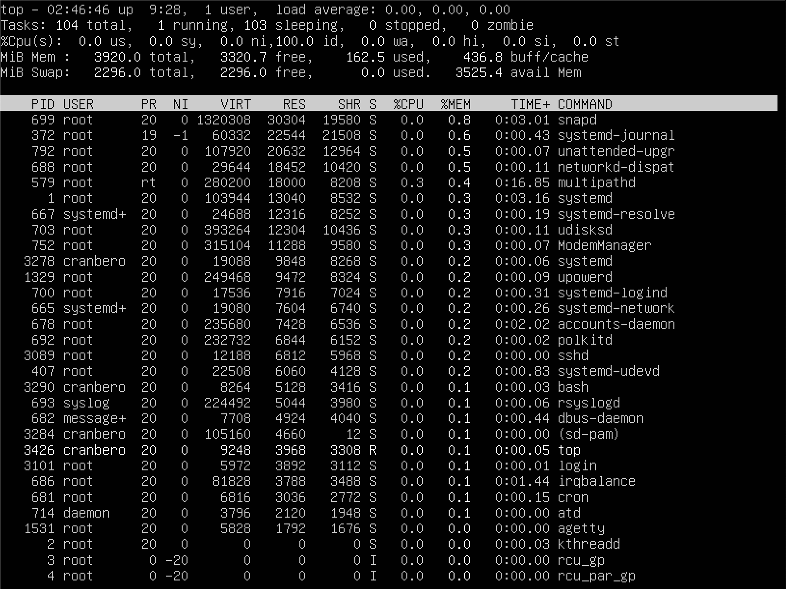
	
	* uptime: `9:28`
	
	* количество авторизованных пользователей: `1`
	
	* общую загрузку системы: `0`
	
	* общее количество процессов: `104`
	
	* загрузку cpu: `0`
	
	* загрузку памяти `162.5`
	
	* pid процесса занимающего больше всего памяти: `699`
	
	* pid процесса, занимающего больше всего процессорного времени: `2807`	
2. Утилита htop.

	* Сортировка по PID:
	
	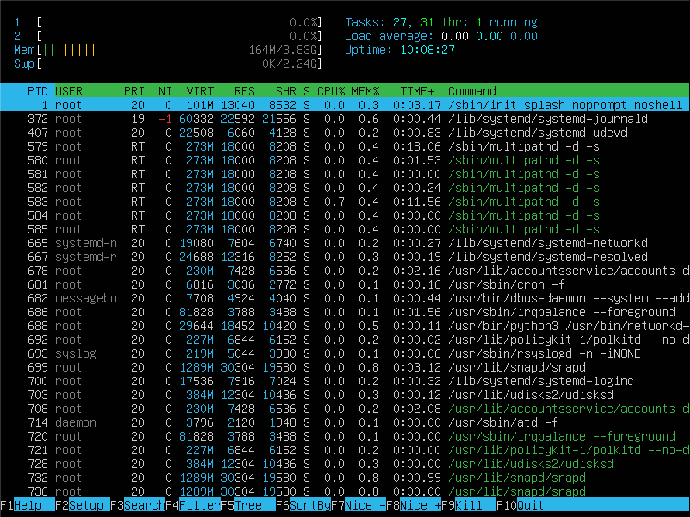
	
	* Сортировка по PERCENT_CPU:
	
	
	
	* Сортировка по PERCENT_MEM:
	
	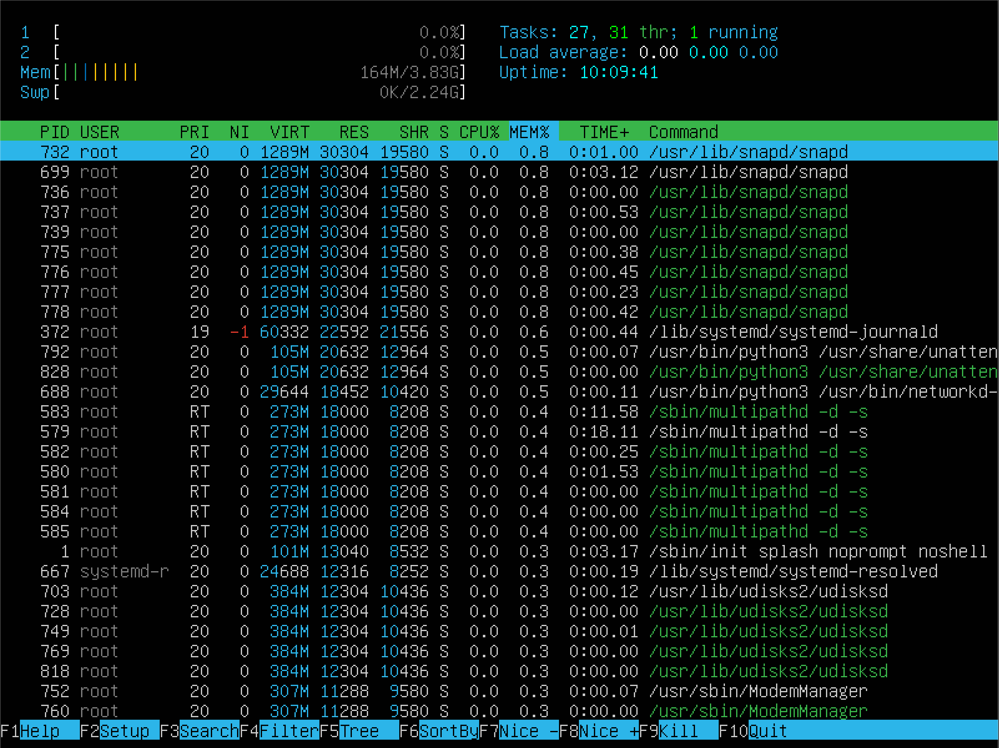
	
	* Сортировка по TIME:
	
	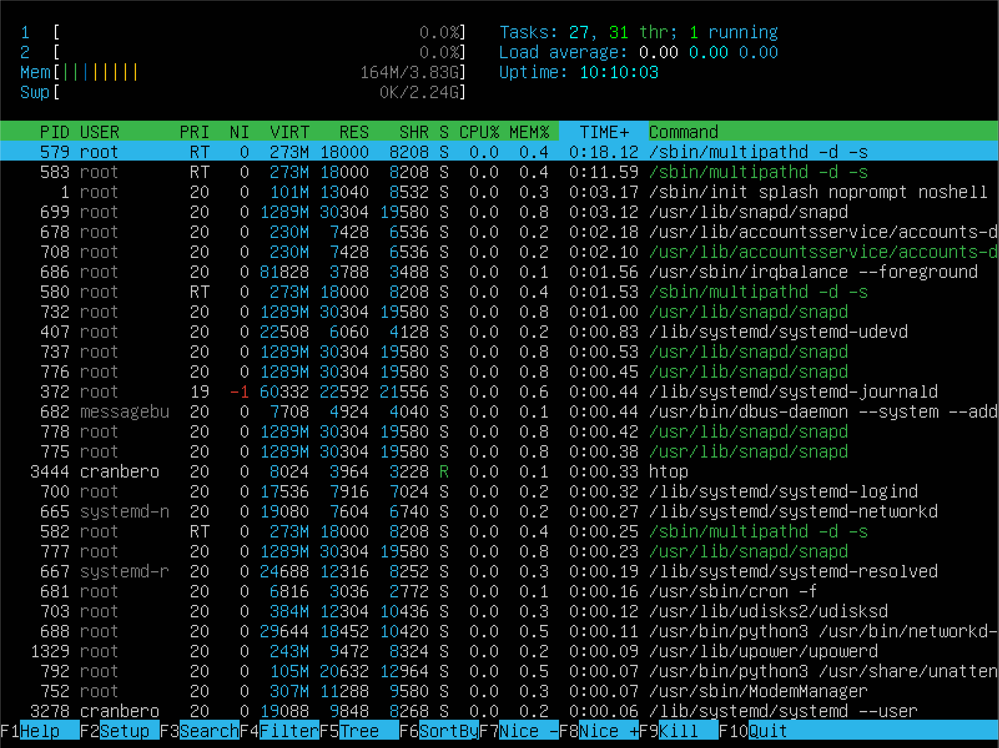
	
	* Фильтрация для процесса sshd:

	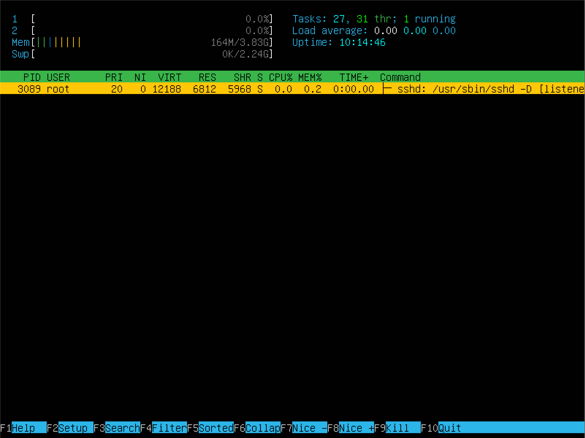
	
	* Процесс syslog, найденный, используя поиск:

	
	
	* Добавленный вывод hostname, clock и uptime:

	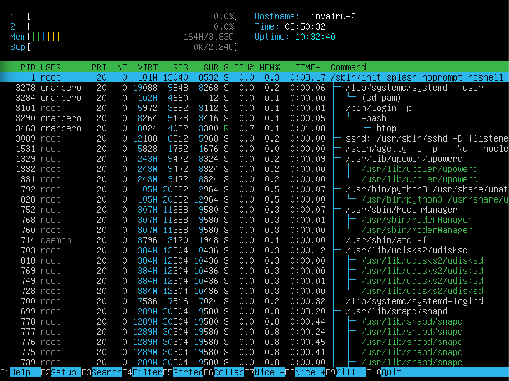
	
## Part 10. Использование утилиты fdisk

~$`fdisk -l`

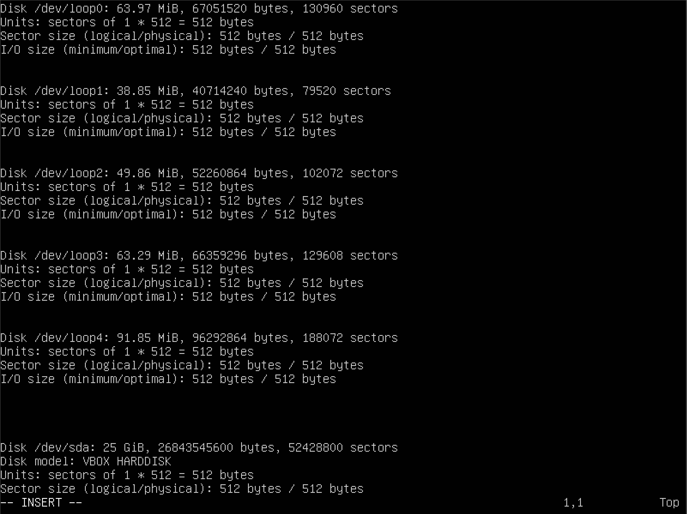

* Название жесткого диска: `dev/sda`;

* Размер и количество секторов: `26843545600 bytes`, `52428800 sectores`;

* размер `swap`: не указан.

## Part 11. Использование утилиты df

1. Команда: ~$`df`:

	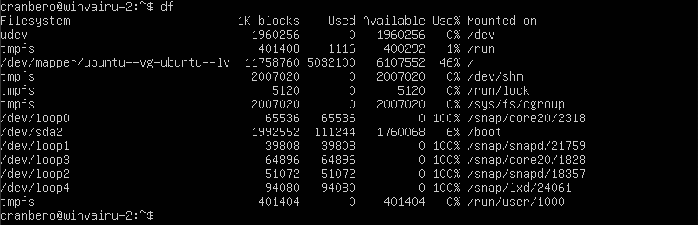

	* Информация корневого раздела (/):

		- размер раздела: 11758760;
	
		- размер занятого пространства: 5032100;
	
		- размер свободного пространства: 6107552;
	
		- процент использования: 46%.

	* единица измерения в выводе: 1K-blocks.

2. Команда: ~$`df -Th`:

	
	
	* Информация корневого раздела (/):

		- размер раздела: 12G;
	
		- размер занятого пространства: 4.8G;
	
		- размер свободного пространства: 5.9G;
	
		- процент использования: 46%.

	* Tип файловой системы для раздела: `ext4`.

## Part 12. Использование утилиты du

1. Запускаем команду ~$`du`:

	

2. Выводим размер папок /home, /var, /var/log (в байтах, в человекочитаемом виде):

	
	
	
	
	

3. Выведи размер всего содержимого в /var/log (не общее, а каждого вложенного элемента, используя *)

	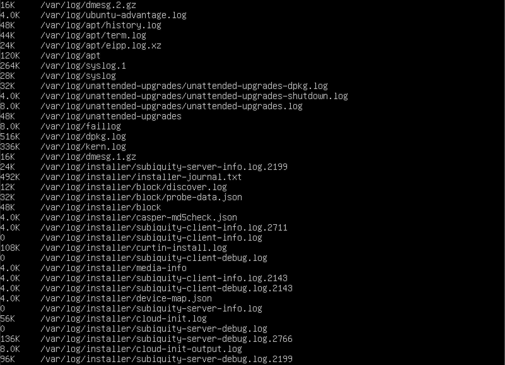
	
	
	
	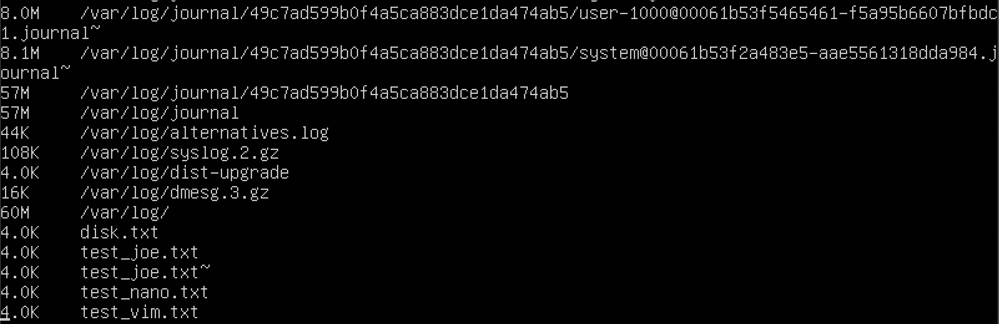
	
## Part 13. Установка и использование утилиты ncdu

1. Hазмер папки /home:

	

2. Hазмер папки /var:

	

3. Hазмер папки /var/log:

	
	
## Part 14. Работа с системными журналами

Смотрим логи:

1. /var/log/dmesg

	~$`less /var/log/dmesg`
	
	

2. /var/log/syslog

	~$`less /var/log/syslog`
	
	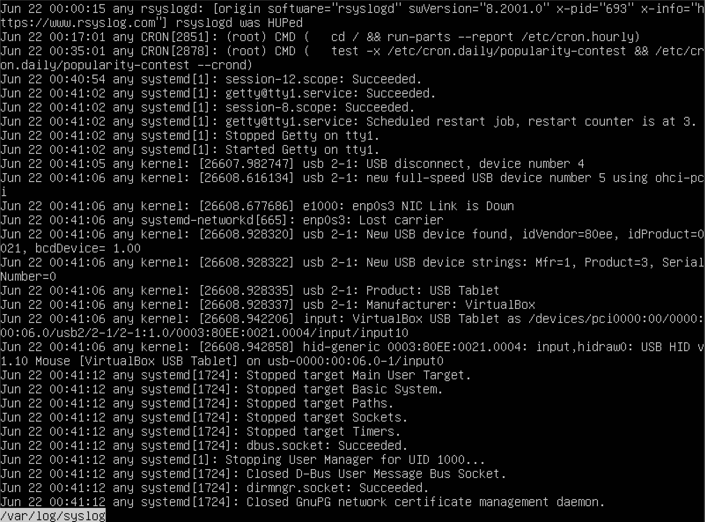

3. /var/log/auth.log

	~$`less /var/log/auth.log`
	
	

	* Время последней успешной авторизации: `Jun 21 11:17:12`, имя пользователя: `newuser` и метод входа в систему: `local`

		

	* Перезапускаем службу sshd:

		~$`sudo systemctl restart sshd`

	* Скрин с сообщением о рестарте службы:

		
		
## Part 15. Использование планировщика заданий CRON
	
1. Создаем новый файл в директории /etc/cron.d/ с именем uptime_checker.

2. Добавляем следующую строку в файл: `    */2  *   *   *   *  root uptime >> /var/log/uptime.log 2>&1`

	Эта строка означает следующее:
	
   	-  `*/2`: запускать каждые 2 минуты.
   	
   -  `*   *   *   *   *`: указывает на то, что задача должна выполняться каждый час, каждый день, каждый месяц, каждый день недели.
   
   - `root`: указывает, что задача должна выполняться от имени пользователя root.
   
   - `uptime`: команда, которую нужно выполнить.
   
   - `>> /var/log/uptime.log`: записывать вывод команды в файл `/var/log/uptime.log`.

3. Запускаем команду `sudo crontab /etc/cron.d/uptime_checker` для применения изменений.

	
	
4. Удаляем все задания из планировщика заданий. Скрин со списком текущих заданий для CRON.

	