## Part 1. Инструмент ipcalc

### 1.1. Сети и маски:

1) Адрес сети 192.167.38.54/13:
   
2) Перевод маски 255.255.255.0 в префиксную и двоичную запись, /15 в обычную и двоичную, 11111111.11111111.11111111.11110000 в обычную и префиксную:
   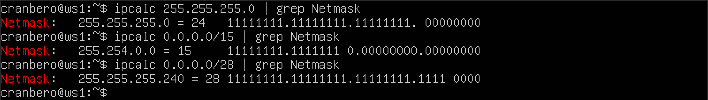
3) Минимальный и максимальный хост в сети 12.167.38.4 при масках: /8, 11111111.11111111.00000000.00000000, 255.255.254.0 и /4:
   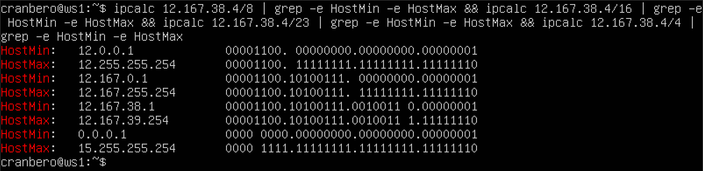

### 1.2. localhost

Адреса localhost всегда находятся в диапазоне 127.0.0.0/8 (то есть от 127.0.0.0 до 127.255.255.255). Любой адрес вне этого диапазона не относится к localhost.

* 194.34.23.100: нет;
* 127.0.0.2: да;
* 127.1.0.1: да;
* 128.0.0.1: нет.

### 1.3. Диапазоны и сегменты сетей

В IPv4 существуют три диапазона частных IP-адресов, которые определены в RFC 1918:

* 10.0.0.0 - 10.255.255.255 (класс A)
* 172.16.0.0 - 172.31.255.255 (класс B)
* 192.168.0.0 - 192.168.255.255 (класс C)

Частные IP-адреса могут использоваться только в локальных сетях и не могут быть маршрутизированы через Интернет.

Диапазон сети 10.10.0.0/18 определяет диапазон IP-адресов от 10.10.0.0 до 10.10.63.255. Для шлюза обычно используются первые или последние адреса из этого диапазона, но теоретически любой адрес в этом диапазоне может быть шлюзом.

Отчет

1. Публичные и частные IP-адреса:

   * Частные: 10.0.0.45, 192.168.4.2, 172.20.250.4, 172.16.255.255, 10.10.10.10;
   * Публичные: 134.43.0.2, 172.0.2.1, 192.172.0.1, 172.68.0.2, 192.169.168.1.
2. Возможные IP-адреса шлюза для сети 10.10.0.0/18:

   * Возможные: 10.10.0.2, 10.10.10.10, 10.10.1.255;
   * Невозможные: 10.0.0.1, 10.10.100.1.

## Part 2. Статическая маршрутизация между двумя машинами

* ws1:
  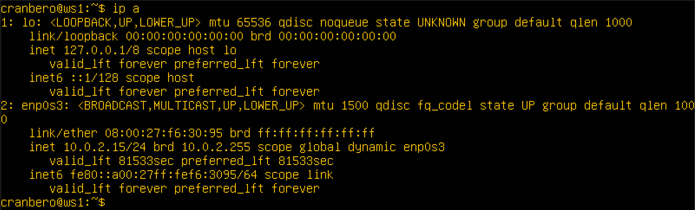
* ws2:
  

 Адреса и маски: ws1 - 192.168.100.10, маска /16, ws2 - 172.24.116.8, маска /12:

  ws1:

  

  ws2:

  

### 2.1. Добавление статического маршрута вручную

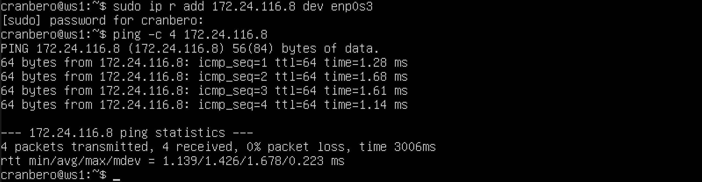

### 2.2. Добавление статического маршрута с сохранением

Перезапускаем машины.

* Добавляем статический маршрут от одной машины до другой с помощью файла /etc/netplan/00-installer-config.yaml.

  

  
  
* Пропингуем соединение между машинами.

  

  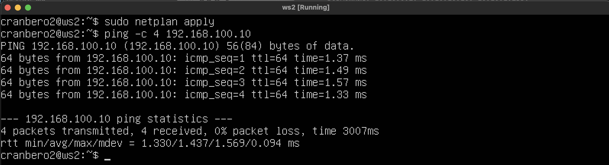

## Part 3. Утилита iperf3

3.1. Скорость соединения

* 8 Mbps = 1 MB/s
* 100 MB/s = 800000 Kbps
* 1 Gbps = 1000 Mbps

3.2. Утилита iperf3

* Cкорость соединения между ws1 и ws2.

  

  

## Part 4. Сетевой экран

### 4.1. Утилита iptables

- Создаем файл /etc/firewall.sh, имитирующий фаерволл, на ws1 и ws2:

  * ws1, /etc/firewall.sh:
    
  * ws2, /etc/firewall.sh:
    
- Запускаем файлы на обеих машинах:

  * 
  * 
  * 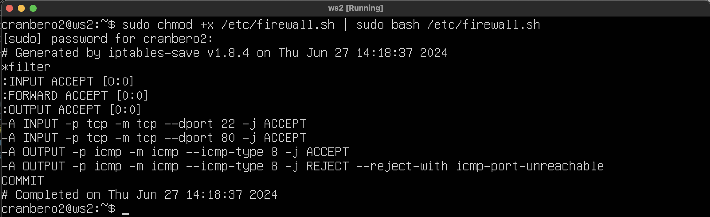
  * 

### 4.2. Утилита nmap

Командой ping найдем машину, которая не «пингуется», после чего утилитой nmap покажем, что хост машины запущен:

ws1:

* 
* 

ws2:

* 
* 

## Part 5. Статическая маршрутизация сети

### 5.1. Настройка адресов машин

#### 5.1.1 Настройка конфигурации машин в etc/netplan/00-installer-config.yaml

* r1:
  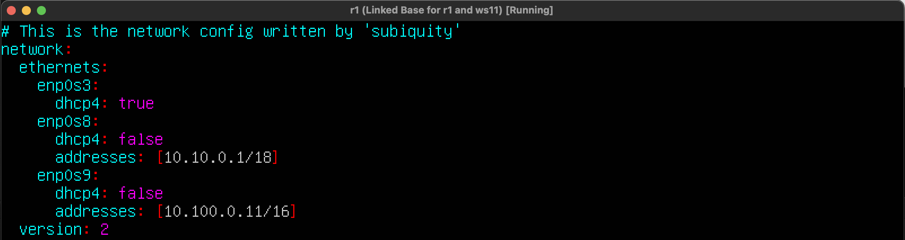
* r2:
  
* ws11:
  
* ws21:
  
* ws22:
  

#### 5.1.2 Командой ip -4 a проверяем, что адрес машины задан верно

* r1:
  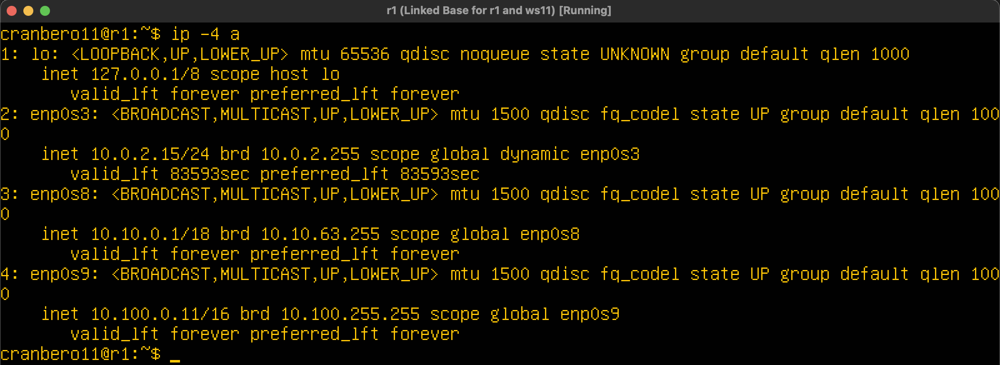
* r2:
  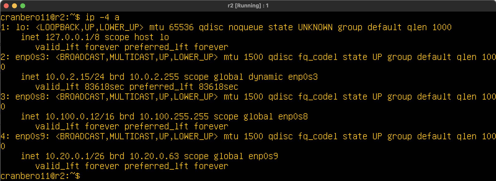
* ws11:
  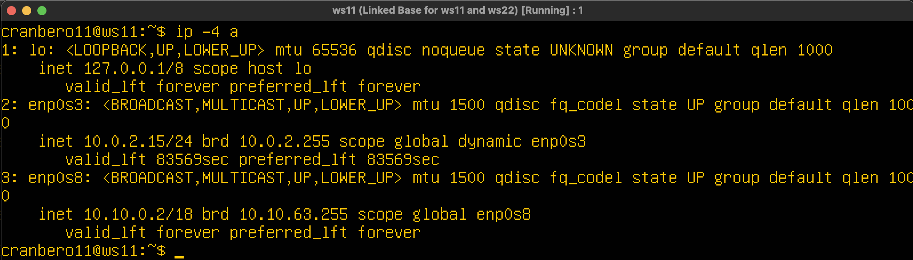
* ws21:
  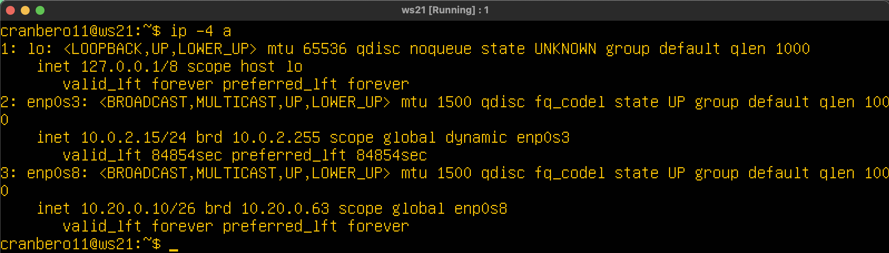
* ws22:
  

#### 5.1.3 Пропингуем ws22 с ws21 и r1 с ws11:

* 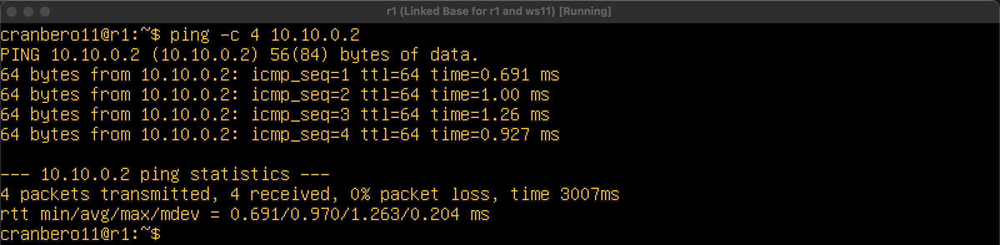
* 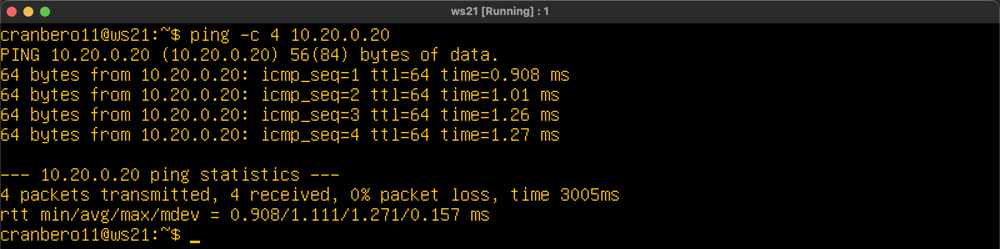

### 5.2. Включение переадресации IP-адресов

#### 5.2.1 Для включения переадресации IP, выполним команду на роутерах:

* 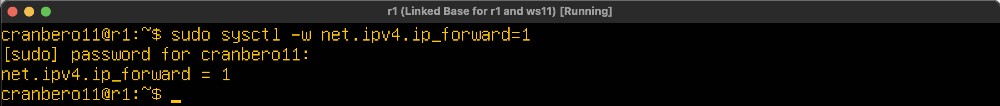
* 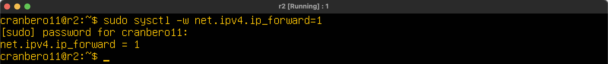

#### 5.2.2 Откроем файл /etc/sysctl.conf и добавим в него следующую строку:

* 
* 

### 5.3. Установка маршрута по-умолчанию

#### 5.3.1 Настроим маршрут по-умолчанию (шлюз) для рабочих станций. Для этого добавим default перед IP роутера в файле конфигураций

* ws11:
  
* ws21:
  
* ws22:
  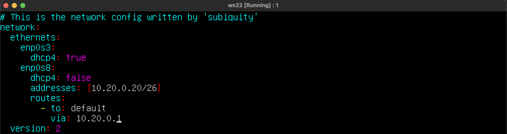

#### 5.3.2 Вызовим ~$`ip r` и покажем, что добавился маршрут в таблицу маршрутизации

* ws11:
   
* ws21:
  
* ws22:
  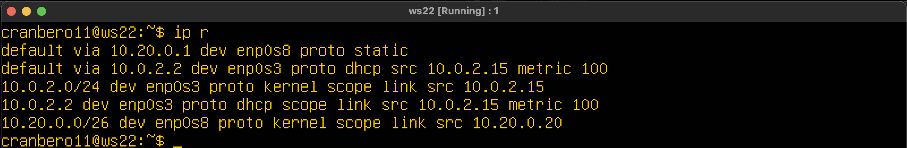

#### 5.3.3 Пропингуем с ws11 роутер r2 и покажи на r2, что пинг доходит. Для этого используем команду:

~$`tcpdump -tn -i enp0s8`

Команда `tcpdump -tn -i enp0s8` используется для захвата и отображения сетевого трафика на интерфейсе `enp0s8` с определенными настройками. Вот подробная расшифровка параметров команды:

`tcpdump`: Основная утилита для захвата сетевого трафика.

`-t`: Убирает временные метки из вывода, чтобы сделать его более читаемым.

`-n`: Отключает разрешение имен хостов и портов. Вместо отображения имен (например, `google.com` или `http`), вывод будет содержать только IP-адреса и номера портов.

`-i enp0s8`: Указывает интерфейс `enp0s8` для захвата трафика. Если этот параметр не указан, `tcpdump` выберет первый доступный интерфейс по умолчанию.

Таким образом, команда tcpdump `-tn -i enp0s8` будет захватывать трафик на сетевом интерфейсе `enp0s8`, показывая IP-адреса и номера портов, без временных меток и разрешения имен хостов/портов.

* ws11:
   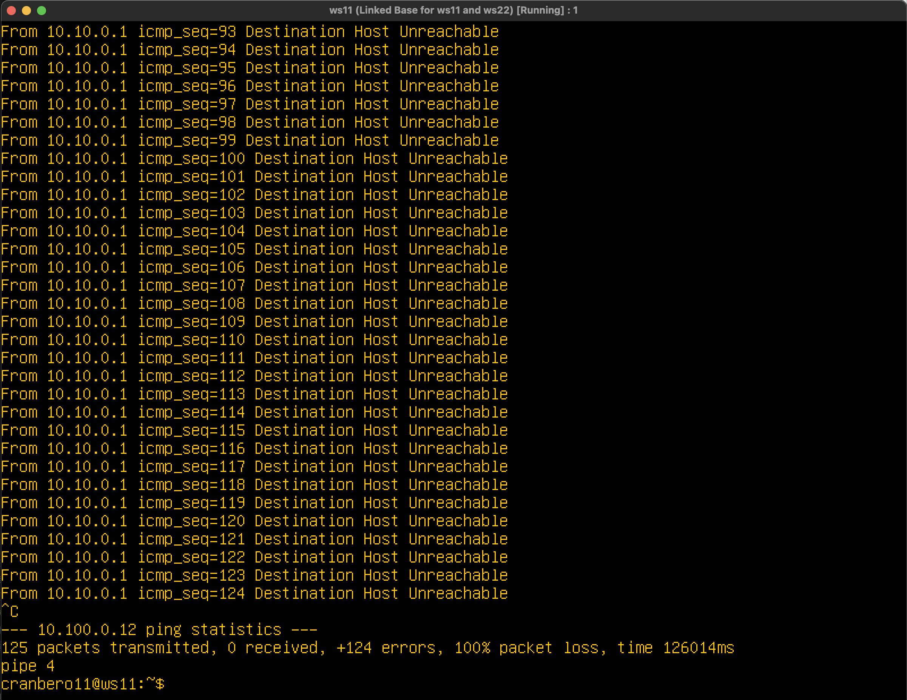

* r2:
  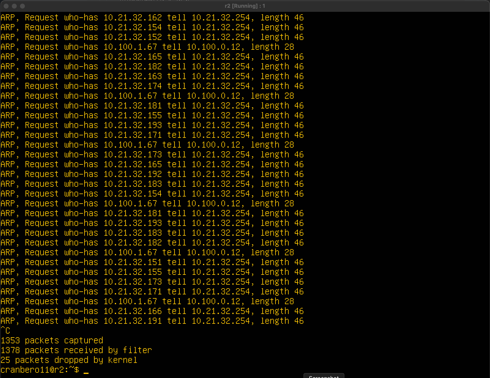
  
### 5.4. Добавление статических маршрутов

Добавим в роутеры r1 и r2 статические маршруты в файле конфигураций

* r1:
	
 
 	

* r2:
	
	
	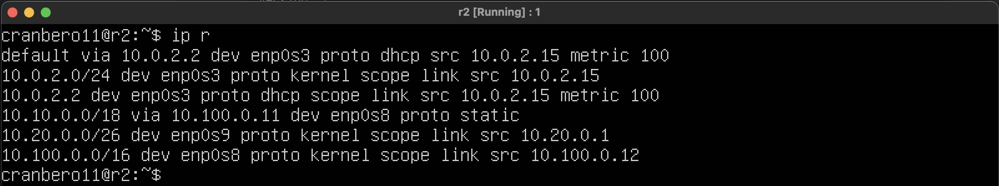
	
Запускаем команды на ws11:

Машина ws11 соединена с сетью 10.10.0.0/18 по своему IP-адресу 10.10.0.2.

### 5.5. Построение списка маршрутизаторов

#### 5.5.1 Запускаем на r1 команду дампа:

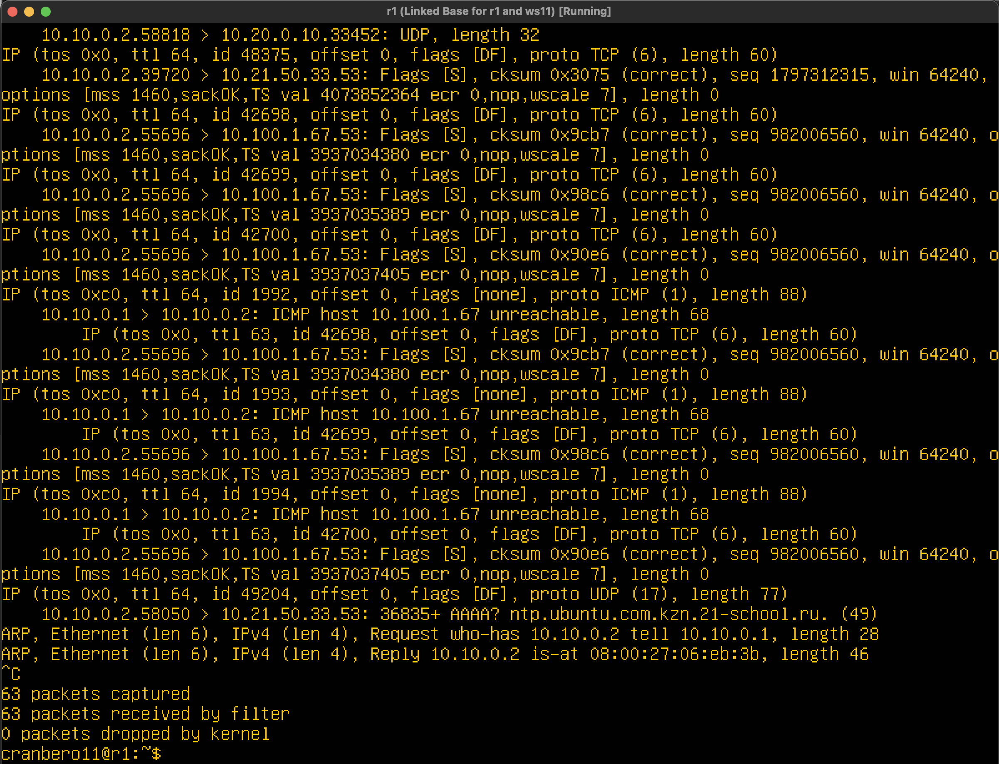

Команда `sudo tcpdump -tnv -i enp0s8` выполняет следующие действия:

`tcpdump`: утилита для захвата и анализа сетевого трафика.

`-t`: не выводить метку времени в начале каждой строки.

`-n`: не преобразовывать IP-адреса в имена хостов (не выполнять обратное разрешение DNS).

`-v`: повышенная детализация вывода (verbose).

`-i enp0s8`: захват трафика на интерфейсе `enp0s8`.

Таким образом, команда захватывает и выводит информацию о сетевом трафике с интерфейса `enp0s8` с повышенной детализацией, без меток времени и имен хостов.

#### 5.5.2 При помощи утилиты traceroute строим список маршрутизаторов на пути от ws11 до ws21:

Команда traceroute linux использует UDP пакеты. Она отправляет пакет с TTL=1 и смотрит адрес ответившего узла, дальше TTL=2, TTL=3 и так пока не достигнет цели. Каждый раз отправляется по три пакета и для каждого из них измеряется время прохождения. Пакет отправляется на случайный порт, который, скорее всего, не занят. Когда утилита traceroute получает сообщение от целевого узла о том, что порт недоступен трассировка считается завершенной.

### 5.6. Использование протокола ICMP при маршрутизации

#### 5.6.1 Запускаем на r1 перехват сетевого трафика, проходящего через enp0s8 с помощью команды:

~$`tcpdump -n -i enp0s8 icmp`

#### 5.6.2 Пропингуем с ws11 несуществующий IP (например, 10.30.0.111) с помощью команды:

## Part 6. Динамическая настройка IP с помощью DHCP

### 6.1 Для r2 настроим в файле /etc/dhcp/dhcpd.conf конфигурацию службы DHCP

1) Укажем адрес маршрутизатора по-умолчанию, DNS-сервер и адрес внутренней сети:

2) В файле resolv.conf пропишем nameserver 8.8.8.8:

### 6.2 Перезагружаем службу DHCP командой:

~$`systemctl restart isc-dhcp-server`:

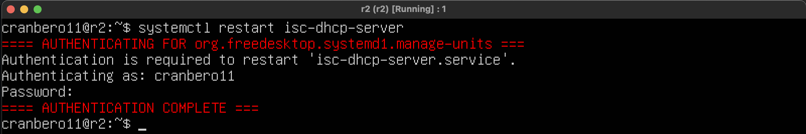

Перезагружаем ws21 при помощи reboot и через `~$ip a` покажем, что она получила адрес:

Пропингуем ws22 с ws21:

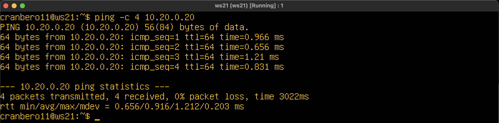

### 6.3 Укажем MAC адрес для ws11, для этого в etc/netplan/00-installer-config.yaml добавим строки: macaddress: 10:10:10:10:10:BA, dhcp4: true

### 6.4 r1 настроим аналогично r2, но сделаем выдачу адресов с жесткой привязкой к MAC-адресу (ws11). Проведем аналогичные тесты.

* 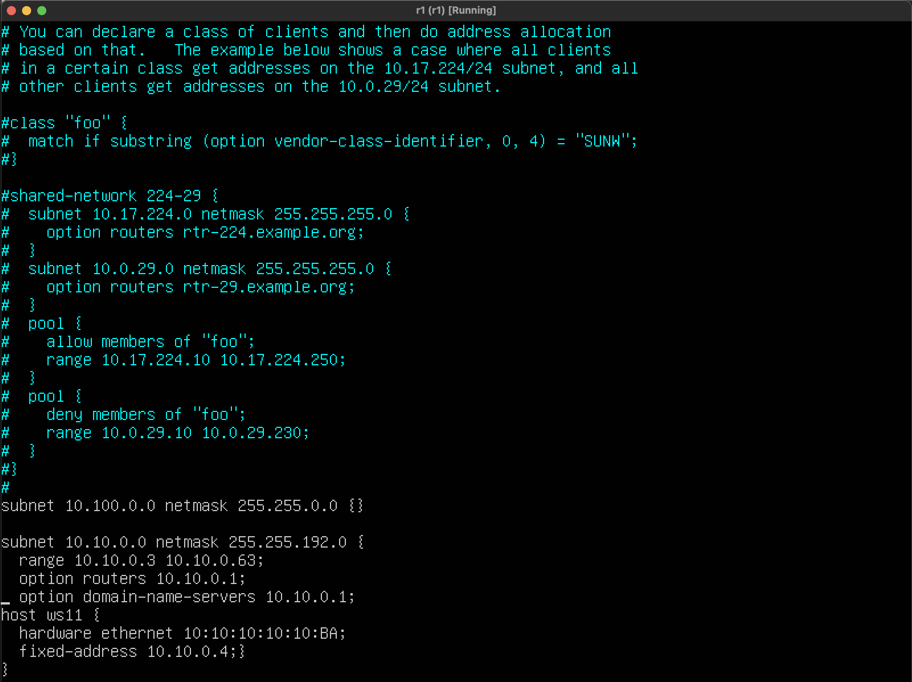

* 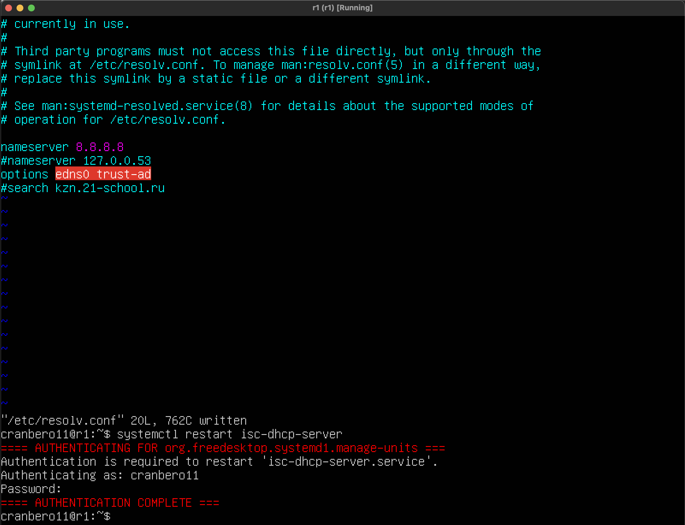

* 

* 

* 

### 6.5 Запросим с ws21 обновление ip адреса.

Запрос обновления IP-адреса осуществляется с помощью DHCP-клиента, который связывается с DHCP-сервером, используя для этого команду dhclient.

*  Проверяем текущий IP-адрес:

	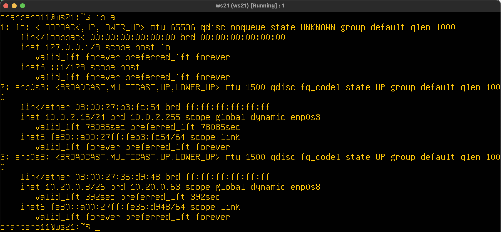
	
* Освобождаем текущий ip адрес и запрашиваем новый:

	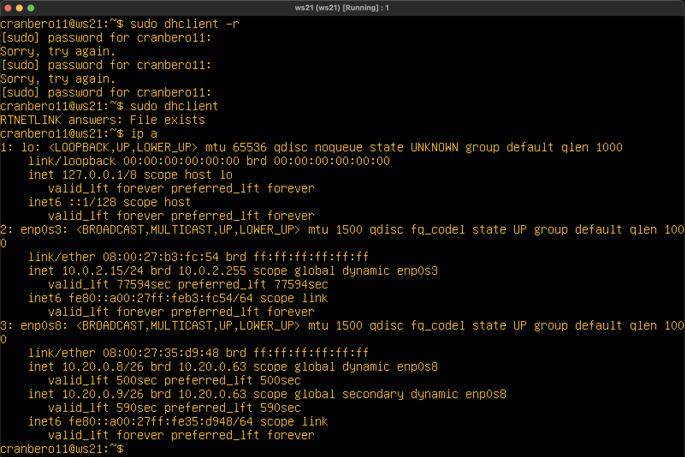
	
* Опции DHCP сервера, используемые для обновления IP-адреса:

	- DHCPDISCOVER: клиент отправляет широковещательное сообщение для поиска DHCP-серверов.

	- DHCPOFFER: DHCP-сервер отвечает, предлагая IP-адрес.

 	- DHCPREQUEST: клиент запрашивает предложенный IP-адрес.

	- DHCPACK: сервер подтверждает запрос клиента и выделяет IP-адрес.

## Part 7. NAT

### 7.1 В файле /etc/apache2/ports.conf на ws22 и r1 изменим строку `Listen 80` на `Listen 0.0.0.0:80`, то есть сделаем сервер Apache2 общедоступным:

* 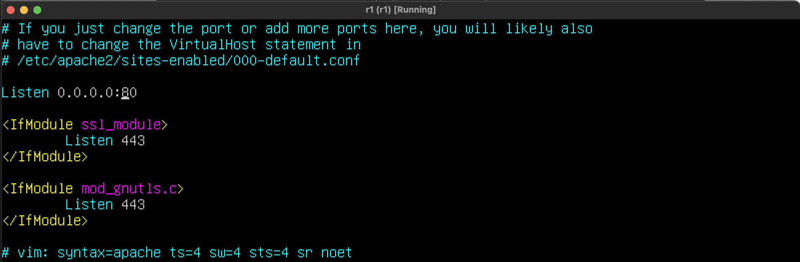

* 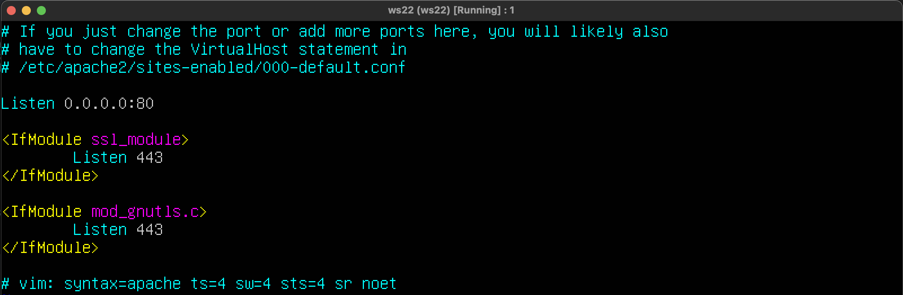

### 7.2 Запустим веб-сервер Apache командой ~$`service apache2 start` на ws22 и r1:

* 

* 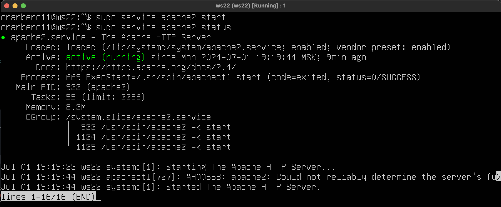

### 7.3 Добавим в фаервол, созданный по аналогии с фаерволом из Части 4, на r2 следующие правила:

1) Удаление правил в таблице filter - `iptables -F`;

2) Удаление правил в таблице "NAT" - `iptables -F -t nat`;

3) Отбрасывать все маршрутизируемые пакеты - `iptables --policy FORWARD DROP`.

* `-F`: Удаляет все правила в таблице по умолчанию (filter).

* `-t nat`: Указывает, что нужно очистить правила в таблице `nat`.

* `--policy`: Устанавливает политику по умолчанию для указанной цепочки.

* `FORWARD`: Цепочка, к которой применяется политика.

* `DROP`: Политика по умолчанию, которая будет применена к пакетам (отбрасывание пакетов).

* 

* 

* 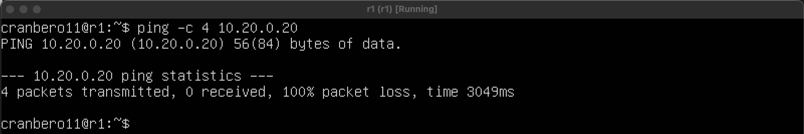

Добавим в файл ещё одно правило:

4) Разрешить маршрутизацию всех пакетов протокола ICMP:

* 

* Завершаем старый процесс через `kill`

* 

* 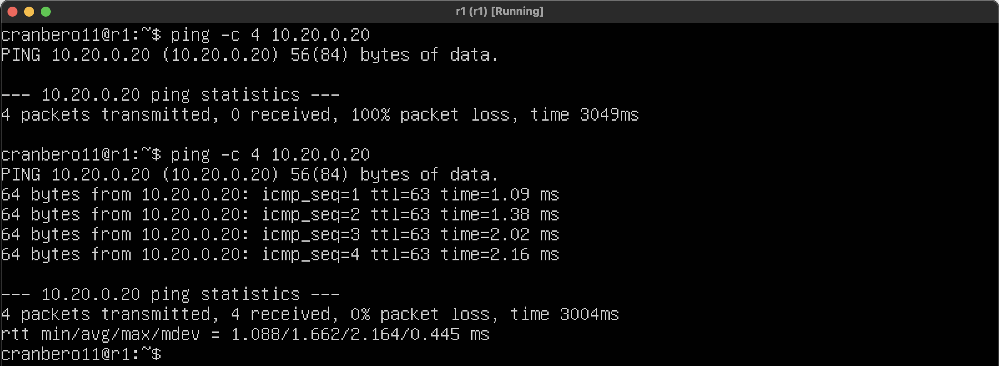

Добавим в файл ещё два правила:

5) Включим SNAT, а именно маскирование всех локальных ip из локальной сети, находящейся за r2 (по обозначениям из Части 5 - сеть 10.20.0.0).

	Совет: стоит подумать о маршрутизации внутренних пакетов, а также внешних пакетов с установленным соединением.

6) Включим DNAT на 8080 порт машины r2 и добавить к веб-серверу Apache, запущенному на ws22, доступ извне сети.

	Совет: стоит учесть, что при попытке подключения возникнет новое tcp-соединение, предназначенное ws22 и 80 порту.
	
* 

### 1. `iptables -A FORWARD -p tcp --dport 80 -j ACCEPT`
- `iptables`: утилита командной строки для настройки и управления таблицами правил фильтрации пакетов в Linux.
- `-A FORWARD`: добавляет (`-A`) правило в цепочку `FORWARD`. Цепочка `FORWARD` используется для пакетов, которые направляются через компьютер (не предназначены для самого компьютера).
- `-p tcp`: правило применяется к пакетам протокола TCP.
- `--dport 80`: правило применяется к пакетам, направленным на порт 80 (HTTP).
- `-j ACCEPT`: действие для пакетов, соответствующих правилу — принять их.

**Общее значение:** Разрешает прохождение TCP-пакетов через компьютер, которые направлены на порт 80.

### 2. `iptables -A FORWARD -m state --state ESTABLISHED -j ACCEPT`
- `iptables`: утилита командной строки для настройки и управления таблицами правил фильтрации пакетов в Linux.
- `-A FORWARD`: добавляет (`-A`) правило в цепочку `FORWARD`.
- `-m state`: использует модуль `state` для отслеживания состояний соединений.
- `--state ESTABLISHED`: правило применяется к пакетам, которые относятся к уже установленным соединениям.
- `-j ACCEPT`: действие для пакетов, соответствующих правилу — принять их.

**Общее значение:** Разрешает прохождение пакетов через компьютер, которые относятся к уже установленным соединениям.

### 3. `iptables -A FORWARD -i enp0s9 -o enp0s8 -j ACCEPT`
- `iptables`: утилита командной строки для настройки и управления таблицами правил фильтрации пакетов в Linux.
- `-A FORWARD`: добавляет (`-A`) правило в цепочку `FORWARD`.
- `-i enp0s9`: правило применяется к пакетам, приходящим через интерфейс `enp0s9`.
- `-o enp0s8`: правило применяется к пакетам, выходящим через интерфейс `enp0s8`.
- `-j ACCEPT`: действие для пакетов, соответствующих правилу — принять их.

**Общее значение:** Разрешает прохождение пакетов, которые приходят через интерфейс `enp0s9` и выходят через интерфейс `enp0s8`.

### 4. `iptables -t nat -A POSTROUTING -o enp0s9 -s 10.20.0.0/26 -j SNAT --to-source 10.100.0.12`
- `iptables`: утилита командной строки для настройки и управления таблицами правил фильтрации пакетов в Linux.
- `-t nat`: указывает таблицу `nat` (Network Address Translation).
- `-A POSTROUTING`: добавляет (`-A`) правило в цепочку `POSTROUTING`. Цепочка `POSTROUTING` применяется к пакетам после того, как маршрутизация определила их путь.
- `-o enp0s9`: правило применяется к пакетам, выходящим через интерфейс `enp0s9`.
- `-s 10.20.0.0/26`: правило применяется к пакетам с исходным адресом из подсети `10.20.0.0/26`.
- `-j SNAT`: действие для пакетов — выполнить Source NAT (SNAT), изменение исходного IP-адреса.
- `--to-source 10.100.0.12`: устанавливает исходный IP-адрес на `10.100.0.12`.

**Общее значение:** Изменяет исходный IP-адрес пакетов из подсети `10.20.0.0/26`, выходящих через интерфейс `enp0s9`, на `10.100.0.12`.

### 5. `iptables -t nat -A PREROUTING -i enp0s8 -p tcp --dport 8080 -j DNAT --to-destination 10.20.0.20:80`
- `iptables`: утилита командной строки для настройки и управления таблицами правил фильтрации пакетов в Linux.
- `-t nat`: указывает таблицу `nat`.
- `-A PREROUTING`: добавляет (`-A`) правило в цепочку `PREROUTING`. Цепочка `PREROUTING` применяется к пакетам перед маршрутизацией.
- `-i enp0s8`: правило применяется к пакетам, приходящим через интерфейс `enp0s8`.
- `-p tcp`: правило применяется к пакетам протокола TCP.
- `--dport 8080`: правило применяется к пакетам, направленным на порт 8080.
- `-j DNAT`: действие для пакетов — выполнить Destination NAT (DNAT), изменение целевого IP-адреса.
- `--to-destination 10.20.0.20:80`: устанавливает целевой IP-адрес и порт на `10.20.0.20:80`.

**Общее значение:** Изменяет целевой IP-адрес и порт TCP-пакетов, приходящих через интерфейс `enp0s8` и направленных на порт 8080, на `10.20.0.20:80`.

SNAT (Source Network Address Translation) и DNAT (Destination Network Address Translation) — это методы преобразования сетевых адресов, используемые для изменения исходных или целевых IP-адресов пакетов в процессе их прохождения через маршрутизатор или брандмауэр.

### SNAT (Source Network Address Translation)
SNAT изменяет исходный IP-адрес и, при необходимости, порт в исходящих пакетах. Это часто используется для:

1. **Выхода в интернет:** В частных сетях устройства имеют локальные IP-адреса, которые не могут быть использованы в интернете. SNAT позволяет этим устройствам выходить в интернет, изменяя их локальные IP-адреса на один публичный IP-адрес.
2. **Консолидации IP-адресов:** Когда множество внутренних IP-адресов должны использовать один внешний IP-адрес, например, в случае ограниченного количества доступных публичных IP-адресов.

**Пример:**
- Внутренний IP-адрес: 192.168.1.10
- Внешний IP-адрес после SNAT: 203.0.113.1

Когда устройство с IP-адресом 192.168.1.10 отправляет пакет в интернет, маршрутизатор изменяет его исходный IP-адрес на 203.0.113.1. Ответные пакеты будут направлены на 203.0.113.1, и маршрутизатор изменит адрес обратно на 192.168.1.10, чтобы доставить их в локальную сеть.

### DNAT (Destination Network Address Translation)
DNAT изменяет целевой IP-адрес и, при необходимости, порт в входящих пакетах. Это часто используется для:

1. **Переадресации трафика:** Когда необходимо направить входящий трафик на определённый сервер или сервис внутри сети.
2. **Разделения нагрузки:** Распределение входящего трафика между несколькими серверами для балансировки нагрузки.

**Пример:**
- Внешний IP-адрес: 203.0.113.2
- Внутренний IP-адрес после DNAT: 192.168.1.20

Когда внешний клиент отправляет пакет на 203.0.113.2, маршрутизатор изменяет целевой IP-адрес на 192.168.1.20 и пересылает пакет в локальную сеть. Ответные пакеты будут направлены на маршрутизатор, который изменит адрес обратно на 203.0.113.2 перед отправкой их внешнему клиенту.

### Взаимодействие SNAT и DNAT
Вместе SNAT и DNAT позволяют устройствам в частных сетях общаться с внешними сетями, обеспечивая преобразование адресов в обе стороны. SNAT обеспечивает корректный выход внутреннего трафика наружу, а DNAT позволяет внешнему трафику достичь нужных внутренних сервисов.

* 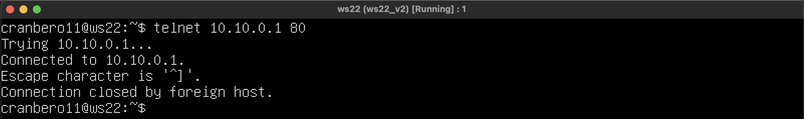

* 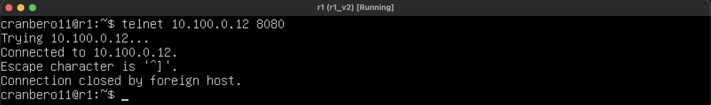

## Part 8. Дополнительно. Знакомство с SSH Tunnels

### 8.1 Запускаем на r2 фаервол с правилами из Части 7.

* 

* 

### 8.2 Запускаем веб-сервер Apache на ws22 только на localhost (то есть в файле /etc/apache2/ports.conf измени строку Listen 80 на Listen localhost:80).

* 

* 

### 8.3 Воспользуемся Local TCP forwarding с ws21 до ws22, чтобы получить доступ к веб-серверу на ws22 с ws21.

* 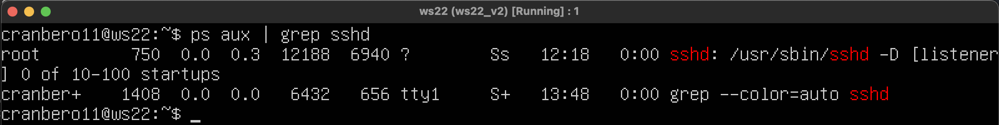

* 

* 

* 

### 8.4 Воспользуемся Remote TCP forwarding c ws11 до ws22, чтобы получить доступ к веб-серверу на ws22 с ws11.

* 

* 

* 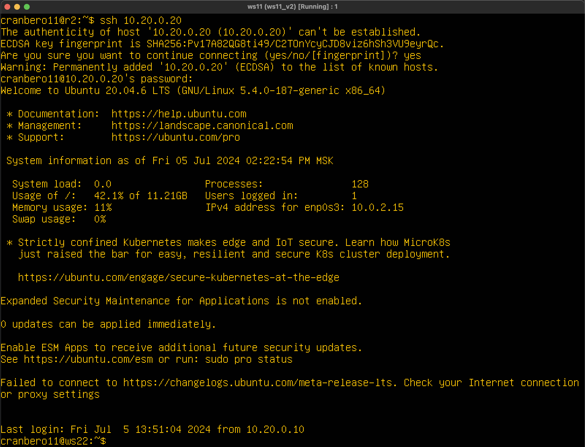

* 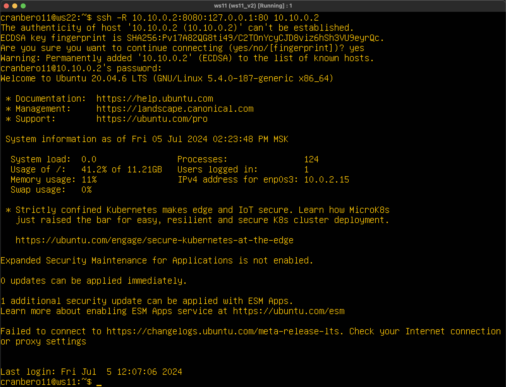

### 8.5 Для проверки, сработало ли подключение в обоих предыдущих пунктах, перейдем во второй терминал (например, клавишами Alt + F2) и выполним команду:

* 

* 

