## Part 1. Готовый докер

* Выкачиваем официальный Docker-образ с Nginx

	`cranbero@un-i4 ~ % docker pull nginx`

	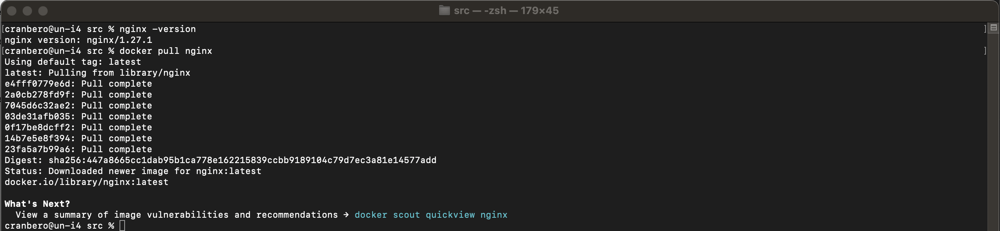

* Проверяем наличие Docker-образа

	`cranbero@un-i4 ~ % docker images`

	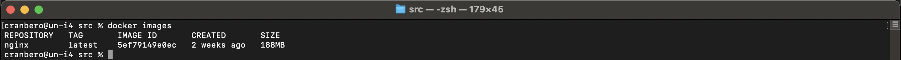

* Запускаем Docker-образ

	`cranbero@un-i4 ~ % docker run -d nginx`

	или используя image_id:

	`cranbero@un-i4 ~ % docker run -d 5ef79149e0ec`

	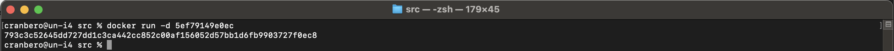

* Проверяем, что образ запустился

	`cranbero@un-i4 ~ % docker ps`

	

* Смотрим информацию о контейнере

	`cranbero@un-i4 ~ % docker inspect 793c3c52645d`

	или по имени контейнера:

	`cranbero@un-i4 ~ % docker inspect festive_ride`

	

	

	

	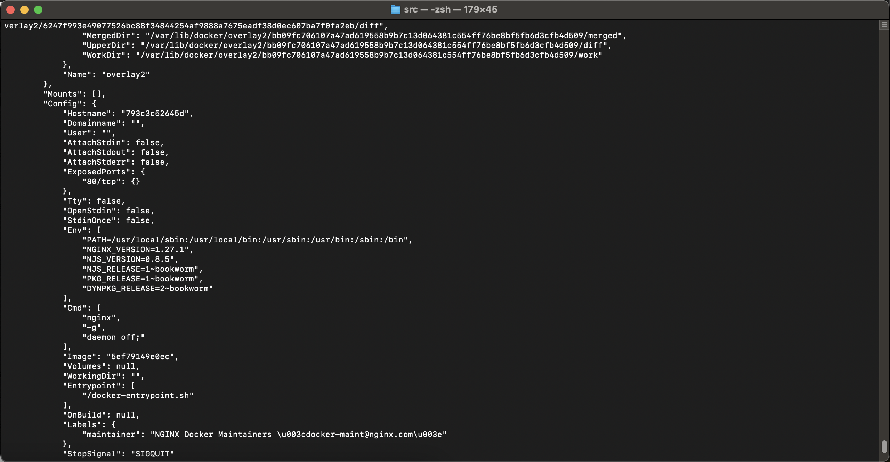

	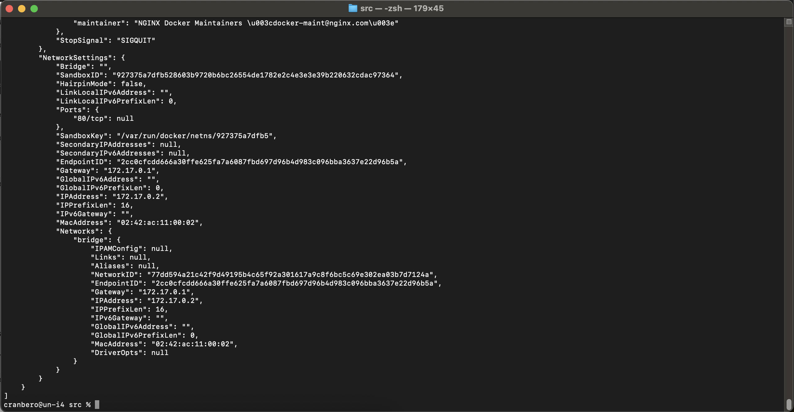

* Извлекаем из вывода информацию и помещаем в отчёт:

	Размер контейнера: 1.09kB (virtual 188MB)

	`cranbero@un-i4 ~ % docker ps -s`

	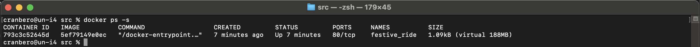

	Список замапленных портов: в секции NetworkSettings -> Ports: `"80/tcp": null`

	IP контейнера: в секции NetworkSettings -> IPAddress: `"IPAddress": "172.17.0.2",,,`

* Останавливаем Docker-контейнер

	`cranbero@un-i4 ~ % docker stop 793c3c52645d`

	или по имени контейнера:
	
	`cranbero@un-i4 ~ % docker stop festive_ride`

	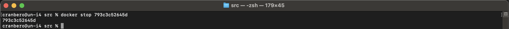

* Проверяем, что контейнер остановился

	`cranbero@un-i4 ~ % docker ps`

	(Проверяем, что контейнер отсутствует в списке запущенных контейнеров.)

	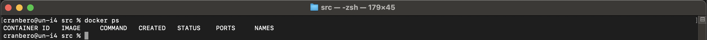

* Запускаем Docker-контейнер с портами 80 и 443

	`cranbero@un-i4 ~ % docker run -d -p 80:80 -p 443:443 5ef79149e0ec`

	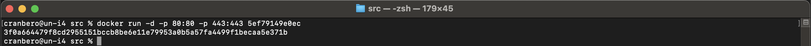

* Проверяем доступность стартовой страницы Nginx

	Открываем браузер и переходим по адресу:

	`http://localhost:80`

	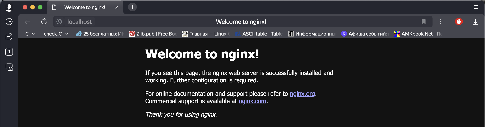

* Перезапускаем Docker-контейнер

	`cranbero@un-i4 ~ % docker restart 3f0a664479f8`

	или по имени контейнера:

	`cranbero@un-i4 ~ % docker restart laughing_newton`

	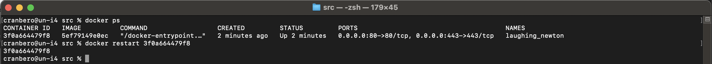

* Проверяем, что контейнер запустился

	`cranbero@un-i4 ~ % docker ps`

	или открываем браузер по адресу `http://localhost:80`, чтобы убедиться, что страница доступна.

	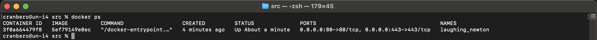

## Part 2. Операции с контейнером

`exec` в контексте Docker — это команда, которая позволяет выполнять команды внутри уже запущенного контейнера. Это полезно, когда вам нужно взаимодействовать с контейнером после его запуска, например, для отладки, настройки или выполнения административных задач.

* Читаем конфигурационный файл nginx.conf внутри Docker-контейнера

	`cranbero@un-i4 ~ % docker exec -it 3f0a664479f8 cat /etc/nginx/nginx.conf`

	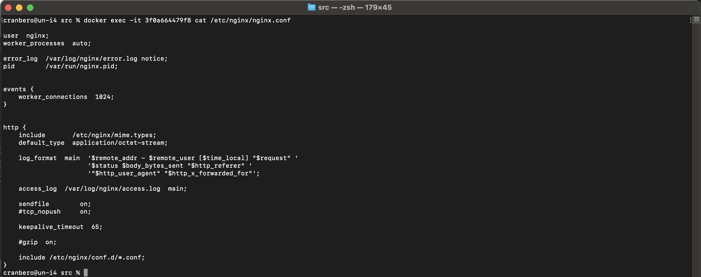

* Создаем на локальной машине файл nginx.conf

	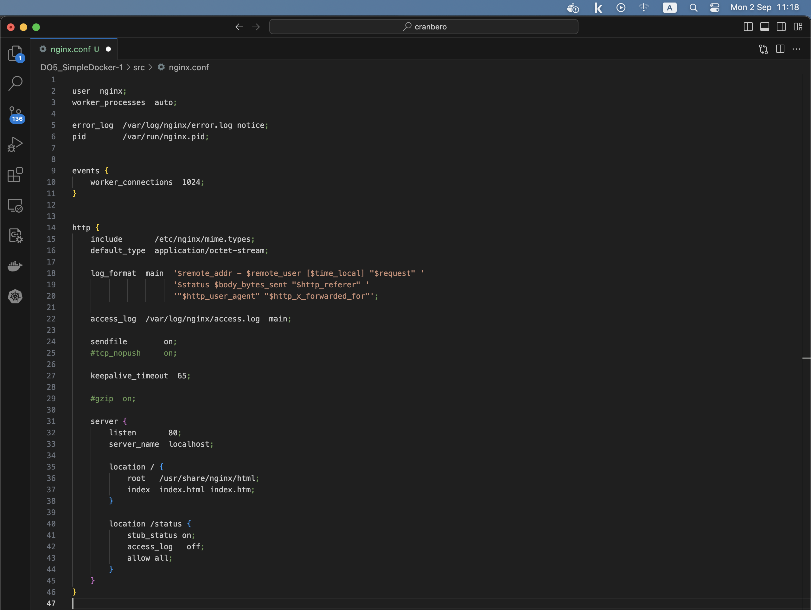

* Скопируем файл nginx.conf внутрь Docker-контейнера

	`cranbero@un-i4 ~ % docker cp ./nginx.conf 3f0a664479f8:/etc/nginx/nginx.conf`

	

* Перезапускаем Nginx внутри Docker-контейнера

	`cranbero@un-i4 ~ % docker exec -it 3f0a664479f8 nginx -s reload`

	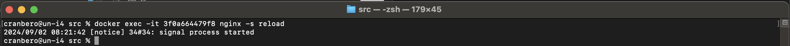

*  Проверяем доступность страницы со статусом по адресу  `http://localhost:80/status`

	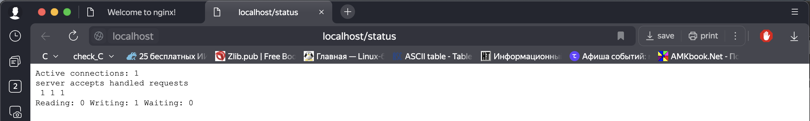

* Экспортируем контейнер в файл container.tar

	`cranbero@un-i4 ~ % docker export 3f0a664479f8 -o container.tar`

	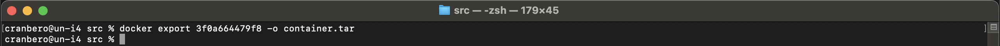

*  Останавливаем контейнер

	`cranbero@un-i4 ~ % docker stop 3f0a664479f8`

	
	
*  Удаляем образ Docker, не удаляя контейнеры

	`cranbero@un-i4 ~ % docker rmi 5ef79149e0ec`

	или

	`cranbero@un-i4 src % docker rmi -f 5ef79149e0ec`

	

* Удаляем остановленный контейнер

	`cranbero@un-i4 src % docker rm 3f0a664479f8`

	

* Импортируем контейнер обратно через команду import

	`cranbero@un-i4 src % cat container.tar | docker import - imported_nginx`

	

* Запускаем импортированный контейнер

	`cranbero@un-i4 src % docker run -d -p 80:80 imported_nginx`

	или

	`cranbero@un-i4 src % docker run -d -p 80:80 imported_nginx nginx -g 'daemon off;'`

	

* Проверяем доступность страницы /status на импортированном контейнере

	`http://localhost:80/status`

	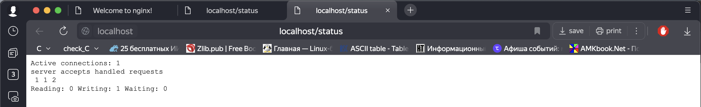