## Part 1. Настройка gitlab-runner

* Поднимаем виртуальную машину Ubuntu Server 22.04 LTS

	`cranbero@winvairu:~$ cat /etc/issue.net`

	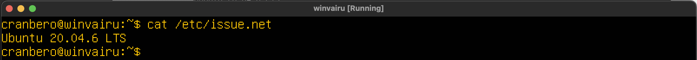

* Убедимся, что все пакеты обновлены

	`cranbero@winvairu:~$ sudo apt update && sudo apt upgrade -y`

	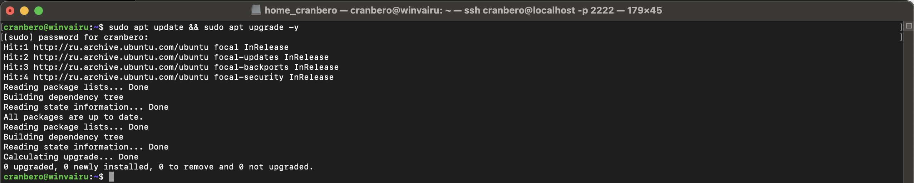

*  Скачаем и установим на виртуальную машину gitlab-runner

	`cranbero@winvairu:~$ curl -LJO "https://s3.dualstack.us-east-1.amazonaws.com/`
	`gitlab-runner-downloads/latest/deb/gitlab-runner_amd64.deb"`

	`cranbero@winvairu:~$ sudo dpkg -i gitlab-runner_amd64.deb`

	

* Запускаем gitlab-runner и зарегистрируем его для использования в текущем проекте (DO6_CICD)

	`cranbero@winvairu:~$ sudo gitlab-runner start`

	`cranbero@winvairu:~$ sudo systemctl status gitlab-runner`

	

	`cranbero@winvairu:~$ sudo gitlab-runner register`

	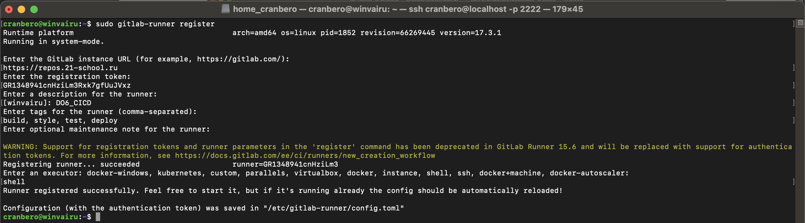

## Part 2. Сборка

* создадим файл `gitlab-ci.yml` с этапом `build`

	

	Pipeline #522238

	

## Part 3. Тест кодстайла

* Напишем этап для CI, который запускает скрипт кодстайла (clang-format)

	

	Pipeline #522398, имеется ошибка в стиле кода

	

	

	Pipeline #522407, после исправления

	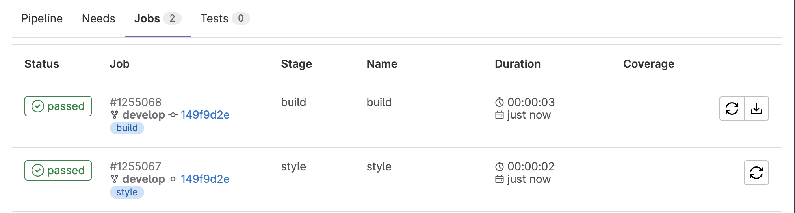

	

## Part 4. Интеграционные тесты

* Напишем этап для CI, который запускает скрипы тестов

	Pipeline #522436

	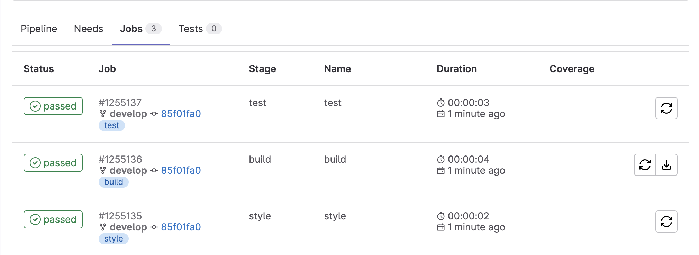

	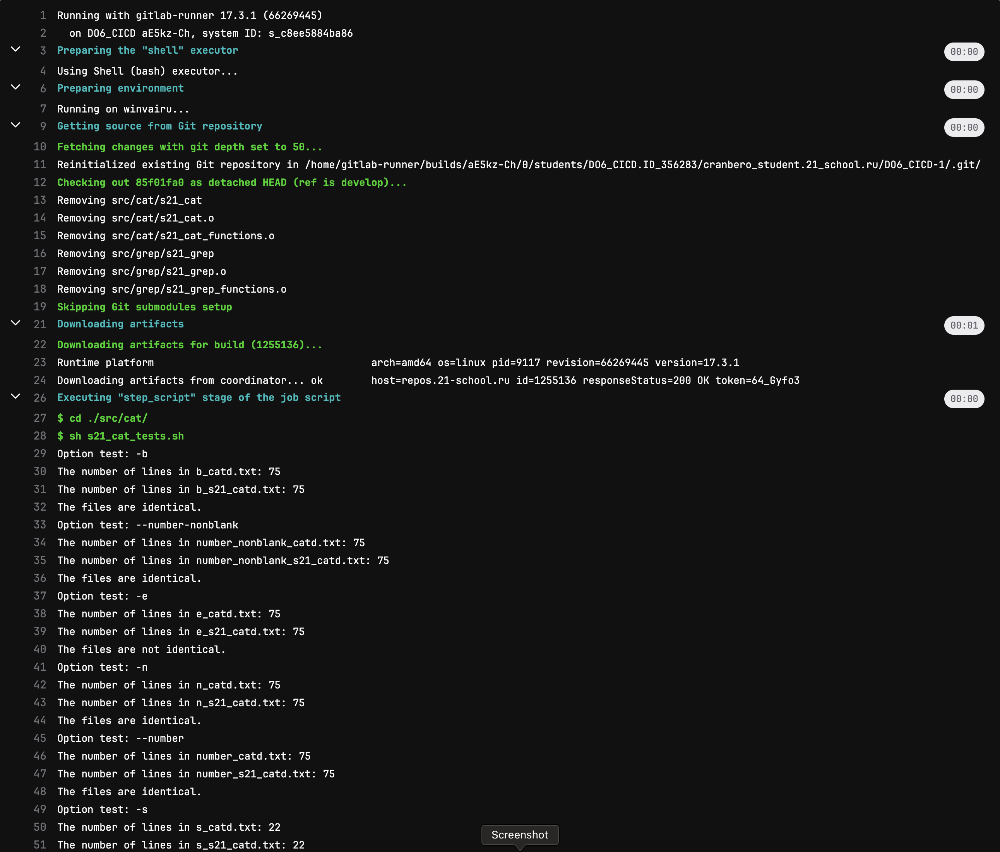

	

	

## Part 5. Этап деплоя

* Настроим сеть между двумя машинами "cranbero" и "cranbero2" с использованием второго сетевого интерфейса (enp0s8)

	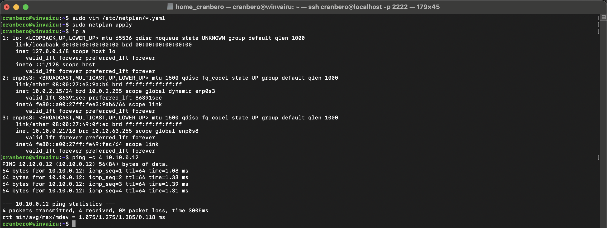

	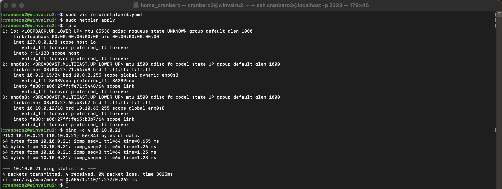
	
	
	
* Возникла проблема с копированием в /usr/local/bin

	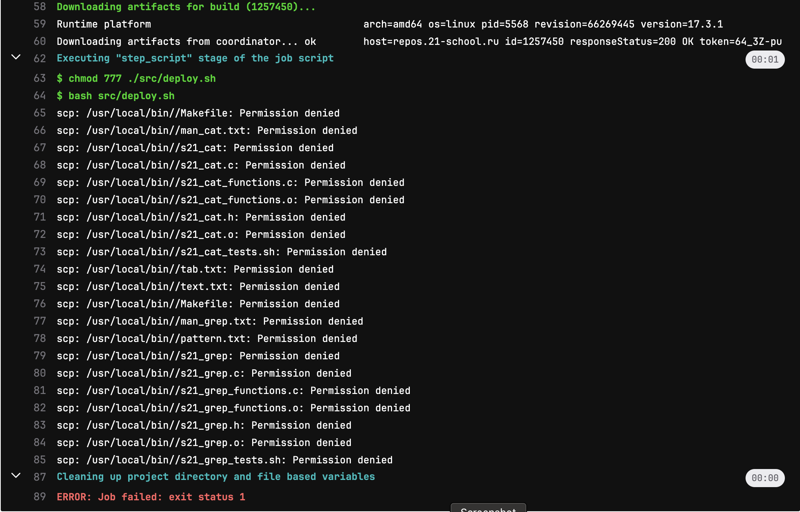
	
	Решилось командой `sudo chmod 777 /usr/local/bin` на второй машине

	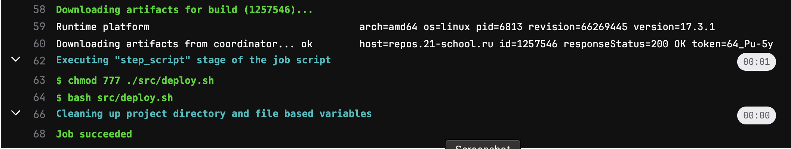

## Part 6. Дополнительно. Уведомления

* Создадим бота через `@BotFather`

	

* Получим `chat_id` через `@getmyid_bot`

	

* Проверяем уведомления

	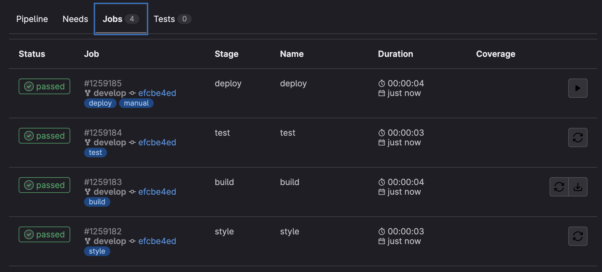

	